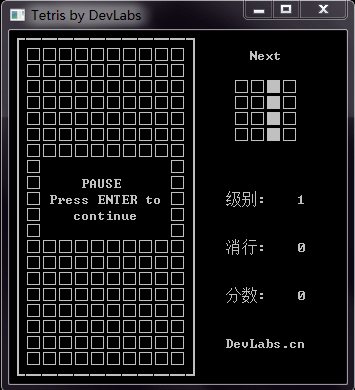

Tetris
======

一个简单易用的俄罗斯方块模块

在Windows控制台上运行:



---
此模块之前是运行于8051系列微处理器上的, 所以内存占用很小, 不支持彩色.

游戏运行的相关逻辑如新方块产生, 地图维护, 边界检测等全部都被封装在模块内部, 
使用回调函数与外部交互. 你所要做的, 就是自己编写UI与按键处理还有分数计算相关函数,
然后在模块初始化时注册模块所需要的回调函数即可. 游戏相关逻辑完全不需要你关心.

---

### 俄罗斯方块相关概念解释

俄罗斯方块的基本元素是一组由4个小型正方形组成的规则图形，在英文称为Tetromino，
在这里称其为方块, 英文写做**brick** . 将构成Tetromino的小正方形称为**box**.  俄罗斯方块共有7种类型，分别以**S、Z、L、J、I、O、T**这7个字母的形状来命名。

经典的俄罗斯方块**地图区** 由 10 \* 20 个box组成.
在此模块中, 设定地图的原点位于左上角, 坐标为(0, 0).

---

### 需要提供给模块的回调函数:
+ 模块导出的接口

```c
extern bool tetris_move(dire_t direction);
extern void tetris_sync(void);
extern void tetris_sync_all(void);
extern bool tetris_is_game_over(void);
extern void tetris_init(void (*draw_box_to_map)(uint8_t x, uint8_t y, bool box),
                        uint8_t (*get_random)(void),
                        void (*next_brick_info)(uint16_t info),
                        void (*remove_line_num)(uint8_t line));
```

---

### 接口说明

+ extern bool tetris_move(dire_t direction);

向某个方向移动方块, 可用的取值为如下枚举类型
```c
// direction
typedef enum
{
    dire_left,      //!< 左移
    dire_right,     //!< 右移
    dire_down,      //!< 下移
    dire_rotate,    //!< 旋转
} dire_t;
```

+ extern void tetris_sync(void);
+ extern void tetris_sync_all(void);

考虑到效率问题, 当方块被移动后显示并不会立即被更新, 
而在是外部认为合适的时候显式的调用这两个函数进行显示刷新.
这两个函数的区别在于 tetris_sync(void) 只会刷新地图中变化的部分(提高效率),
而 tetris_sync_all(void) 则会刷新整个地图(比如在地图显示区域叠加显示了其它信息
而使地图区域遭到破坏).

+ extern bool tetris_is_game_over(void);
当在地图中无法容纳新方块时, 游戏结束, 此函数返回**true**

+ extern void tetris_init()
模块初始化函数, 需要注册几个必须的回调函数:

1. remove_line_num(uint8_t line)
   当产生消行时回调此函数, 参数为消除的行数.

2. draw_box_to_map(uint8_t x, uint8_t y, bool box)
   在地图指定的坐标画一个或清除一个**box**, 取决于第三个参数box的值.
   *true* 为画一个box, *false* 为清除一个box.

3. get_random(void)
   获取一个随机数, 用于产生新方块.

4. next_brick_info(uint16_t info)
   当产生新方块后下一个方块的信息(用于预览)将会回调此函数传回.
   预览方块的信息使用一个无符号16位整数表示, 每4bit一组, 为1的地方表示需要绘制一个box.
   比如有十六进制数 0x0660, 展开二进制分组为:
```c
                    0000    // bit15 - bit12
                    0110    // bit11 - bit8
                    0110    // bit7  - bit4
                    0000    // bit3  - bit0
```
   即此十六进制数表示一个O型的方块.

在platfrom/windows下是在Windows控制台下实现的代码, 供参考.
如果安装了GCC, 运行builder.bat可直接编译.
如果使用IDE可以将所有的.c文件和.h文件放入一个文件夹添加进工程编译即可.

